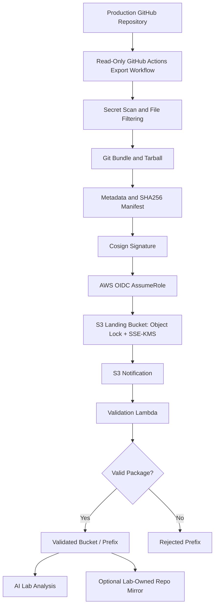

# Source Code Ingestion Data Flow

```mermaid
flowchart TD
    A[Production GitHub Repository] --> B[Read-Only GitHub Actions Export Workflow]
    B --> C[Secret Scan and File Filtering]
    C --> D[Git Bundle and Tarball]
    D --> E[Metadata and SHA256 Manifest]
    E --> F[Cosign Signature]
    F --> G[AWS OIDC AssumeRole]
    G --> H[S3 Landing Bucket: Object Lock + SSE-KMS]
    H --> I[S3 Notification]
    I --> J[Validation Lambda]
    J --> K{Valid Package?}
    K -->|Yes| L[Validated Bucket / Prefix]
    K -->|No| M[Rejected Prefix]
    L --> N[AI Lab Analysis]
    L --> O[Optional Lab-Owned Repo Mirror]
```
